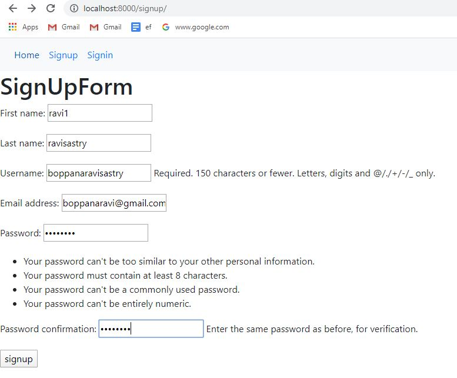

# User Registration and User Authentication

- This document explains the usage of Django’s authentication system in its default configuration. This configuration has evolved to serve the most common project needs, handling a reasonably wide range of tasks, and has a careful implementation of passwords and permissions.
- Django authentication provides both authentication and authorization together and is generally referred to as the authentication system, as these features are somewhat coupled.

### User objects
User objects are the core of the authentication system. They typically represent the people interacting with your site and are used to enable things like restricting access, registering user profiles, associating content with creators etc. Only one class of user exists in Django’s authentication framework, i.e., 'superusers' or admin 'staff' users are just user objects with special attributes set, not different classes of user objects.

The primary attributes of the default user are:
- username
- first_name
- last_name
- email
- password1
- password2

# Creating a Django Project & Application

- After installing Django, you need to create a project using django.

### Project Create
```
  django-admin startproject ravi
```
- Next, create an application using manage.py, you can name it user

### App Create
```
  django-admin startapp user
```
> **_NOTE:_** Don't forget to mention app name in INSTALLED_APPS list of settings.py file, if you created a new app

```python
INSTALLED_APPS = 
[
    'user',(appname)
         ]
```
### Forms     
First we need to create **froms.py** file in our app location

**`forms.py`**
```python
from django.contrib.auth.forms import UserCreationForm
from django.contrib.auth.models import User

class RegisterForm(UserCreationForm):
	class Meta:
		model = User
		fields = ['username','first_name','last_name','email','password1','password2']
```
We need to import Django forms first (from django.contrib.auth.forms import UserCreationForm and from django.contrib.auth.models import User). Next, we have class Meta. Finally, we can say which field(s) should end up in our form. In this scenario if we want only few fields then metion them in a list formate.

### Sync With database

Now that we’ve created the form, it’s time to add it to the database. To do this we need to open Command Promnt and run these two commands: 
-	python manage.py makemigrations 
-	python manage.py migrate
Your terminal output should look something like this:


### Views
**`views.py`**
```python
from django.shortcuts import render,redirect
from user.forms import *
# Create your views here.

def home(request):
	return render(request,'user/home.html')
```

Initially we are using get method, To check how from is working, Here we are using BootstrapCDN
> **_NOTE:_** Add the  to every Django template you create that uses POST to submit data. This will reduce the chance of forms being hijacked by malicious users.

### Templates

**`home.html`**

```html
<!DOCTYPE html>
<html lang="en">
<head>
  <title>Bootstrap Example</title>
  <meta charset="utf-8">
  <meta name="viewport" content="width=device-width, initial-scale=1">
  <link rel="stylesheet" href="https://maxcdn.bootstrapcdn.com/bootstrap/4.4.1/css/bootstrap.min.css">
  <script src="https://ajax.googleapis.com/ajax/libs/jquery/3.5.1/jquery.min.js"></script>
  <script src="https://cdnjs.cloudflare.com/ajax/libs/popper.js/1.16.0/umd/popper.min.js"></script>
  <script src="https://maxcdn.bootstrapcdn.com/bootstrap/4.4.1/js/bootstrap.min.js"></script>
</head>
<body>
<nav class="navbar navbar-expand-sm bg-light">
  <ul class="navbar-nav">
    <li class="nav-item">
      <a class="nav-link" href="">Home</a>
    </li>
    <li class="nav-item">
    	
      <a class="nav-link" href="">Signout</a>
    </li>
    
    <li class="nav-item">
      <a class="nav-link" href="">Signup</a>
    </li>
    <li class="nav-item">
      <a class="nav-link" href="">Signin</a>
    </li>
    
  </ul>
</nav>


</body>
</html>
```

### Urls

Now our task is to add project urls(studentmanagement).

**`ravi(project)/urls.py`**
```python
from django.contrib import admin
from django.urls import path
from user import views
from django.contrib.auth import views as auth_views

urlpatterns = [
    path('admin/', admin.site.urls),
    path('',views.home,name = 'show'),
    path('signup/',views.signup,name = 'signup'),
    path('signin/',auth_views.LoginView.as_view(template_name='user/signin.html'),name = 'signin'),
    path('signout/',auth_views.LogoutView.as_view(template_name='user/signout.html'),name = 'signout'),
]
```

Now run this project **manage.py** location open command prompt(cmd).

```
	python manage.py runserver
```
Now open browser and type url path
```
	https:localhost:8000
```


### Form validation
Till now we haven't used post method from register.html, a visitor will hit the `submit` button after filling up the details, that means the form method is changed to "POST".

Now our task is to validate the form and save details, for that we need to change register function in views.py 

**`views.py`**
``` python
def signup(request):
	if request.method=="POST":
		form = UserSignUpForm(request.POST)
		if form.is_valid():
			form.save()
			return redirect('/signin')
	form = UserSignUpForm()
	return render(request,'user/signup.html',{'form':form})
```
is_valid() validates the form details given by visitor

**`signup.html`**

```html


	<h1>SignUpForm</h1>
	<form method="POST" action="">
		
		{{form.as_p}}
		<input type="submit" value="signup">
	</form>

```


- We can must add the inside **settings.py** file below in LOGIN_URL links.
```python
	LOGIN_REDIRECT_URL = 'show'
	LOGIN_URL = 'signin'
```


**`signin.html`**

```html


<h1>SigninForm</h1>
	<form method="POST">
		
		{{form.as_p}}
		<input type="submit" value="signin">
	</form>
 
```


**`signout.html`**

```html


<p>Sucessfully signout{{request.user}}</p>

```
before signout window.


after signout window.


