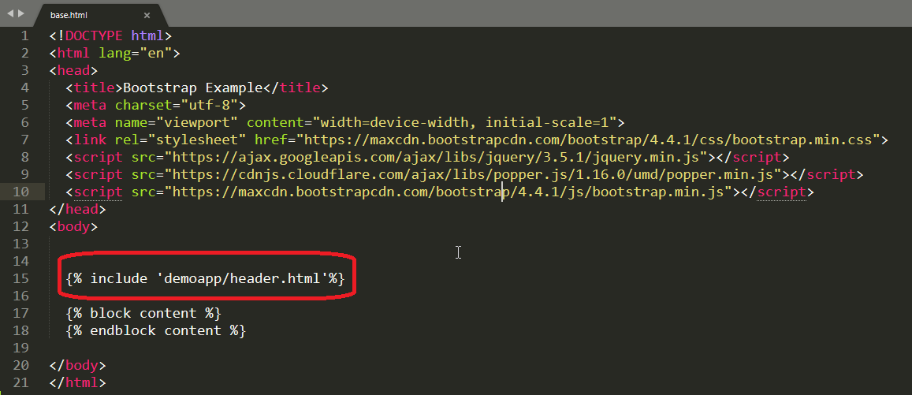

# Django Template Language(D.T.L)

* This document explains the language syntax of the Django template system.
* Django’s template language is designed to strike a balance between power and ease.
* It’s designed to feel comfortable to those used to working with HTML.

**A template consists of static parts of the desired HTML output as well as some special syntax describing how dynamic content will be inserted.**

## Why Django Template?

* In HTML file, we can't write python code because the code is only interpreted by python interpreter not the browser. We know that HTML is a static markup language, while Python is a dynamic programming language.

* Django template engine is used to separate the design from the python code and allows us to build dynamic web pages.

## Django Template Configuration

**To configure the template system, we have to provide some entries in ```settings.py file```.**

````
TEMPLATES = [
    {
        'BACKEND': 'django.template.backends.django.DjangoTemplates',
        'DIRS': [],
        'APP_DIRS': True,
        'OPTIONS': {
            'context_processors': [
                'django.template.context_processors.debug',
                'django.template.context_processors.request',
                'django.contrib.auth.context_processors.auth',
                'django.contrib.messages.context_processors.messages',
            ],
        },
    },
]
````

**Here, we mentioned that our template directory name is templates. By default, DjangoTemplates looks for a templates subdirectory in each of the INSTALLED_APPS.**

## Django Template Simple Example

* First, create a directory Django App inside ```templates folder```,```appfolder```,  inside the project app as we did below

````
templates/appnanme/base.html

````
**Inside base.html apply with Code**


____

**before create header.html template** 

## Tags

* In a template, Tags provide ``arbitrary logic`` in the rendering process. For example, a tag can output content, serve as a control structure e.g. an ```"if" statement``` or a ```"for" loop```, grab content from a database etc.

``Tags are surrounded by  braces``.

**For Example**

````
  
  
  
    Hello, {{ user.username }}.  

````

**here inside base.html we can load with include – Django Template Tags Syntax is ``````**

```



```

## include – Django Template Tags

* Django templates not only allow passing data from view to template, but also provides some limited features of programming such as ````variables````, ````for loops````, ````comments````, ````extends````, ````include````,````if````,````endif````,````else````.

## how to use include tag in Templates

* ```include tag``` **loads a template and renders it with the current context**. This is a way of “including” other templates within a template. The template name can either be a variable or a hard-coded (quoted) string, in either single or double quotes.


### include with header.html



____

**After that create a template header.html inside the ``templates/appname/filename.html``.

**create header.html template**

* Inside header.html apply code [navbar](https://www.w3schools.com/bootstrap4/bootstrap_navbar.asp)


## extends – Django Template Tags

* Django templates not only allow passing data from view to template, but also provides some limited features of programming such as ````variables````, ````for loops````, ````comments````, ````extends````, ````include````,````if````,````endif````,````else````.


## how to use extends tag in Templates

* ``extends tag`` in Templates. extends tag is used for inheritance of templates in django. One needs to repeat the same code again and again. Using extends we can inherit templates as well as variables.

**Syntax**

``

``

**create home.html template**


**urls.py**
``
path('home/',views.home,name="home)
``

**views.py**

```
def home(request):
    return render(request,'appname/home.html')
```

## Run Server
* Execute the following command and access the template by entering localhost:8000/home at the browser.


**Variables**

* Variables associated with a context can be accessed by ``{{}}`` (double curly braces). For example, a variable name value is APSSDC. Then the following statement will replace name with its value.

``
My name is {{name}}.    
My name is APSSDC  
``

## Django Variable Example

**views.py**

````
def index(request):
	name={
	'name' : 'APSSDC'
	}
	return render(request,'demoapp/home.html',name)
````

**home.html**

```


Home



<h1 style="color: red">Welcome To {{name}}</h1>


```

## output


## Static Contact Details

**urls.py**

````
path('contact/',views.contact,name="contact")
````
**views.py**

````
def contact(request):
	details={
	'company':'apssdc',
	'place':'vijayawada',
	'mobileno':'123456789',
	'email':'andhra@apssdc.in'
	}
	return render(request,'demoapp/contact.html',details)
````

**contact.html**

````

Home

<table>
	<tr>
		<th>Company:-</th> 
		<td>{{company}}</td><tr>
		<th>place:-</th>
		<td>{{place}}</td><tr>
		<th>MobileNO:-</th>
		<td>{{mobileno}}</td><tr>
		<th>Email:-</th>
		<td>{{email}}</td>
	</tr>
</table>


````

## output


____

## Static Contact Details

**urls.py**

````
path('about/',views.about,name="about")
````

## output


____

## Django Template Syntaxs

**Iteration**
````



````
____

**Condition**

````




````

